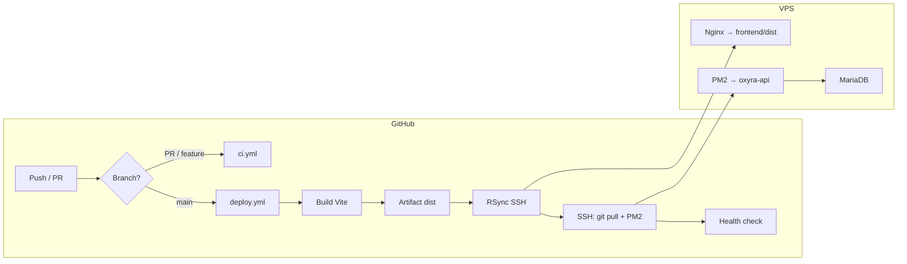

# Oxyra — Guía de despliegue (CI/CD)

Documentación para configurar **GitHub Actions**, **secrets**, **variables** y el **VPS** de producción.

---

## Arquitectura del pipeline



| Workflow | Archivo | Cuándo se ejecuta |
|----------|---------|-------------------|
| **CI** | [`.github/workflows/ci.yml`](workflows/ci.yml) | Pull requests y pushes que no son `main` |
| **Deploy** | [`.github/workflows/deploy.yml`](workflows/deploy.yml) | Push a `main` o ejecución manual |

---

## 1. Secrets en GitHub (obligatorios)

Ir a: **Repository → Settings → Secrets and variables → Actions → New repository secret**

| Secret | Descripción | Ejemplo |
|--------|-------------|---------|
| `VPS_HOST` | IP o dominio del VPS | `187.33.xxx.xxx` o `vps.tudominio.es` |
| `VPS_USER` | Usuario SSH | `Jordi` |
| `VPS_PORT` | Puerto SSH | `2222` |
| `VPS_SSH_PRIVATE_KEY` | Clave privada SSH completa (PEM) | Contenido de `id_rsa` o `id_ed25519` |
| `VITE_API_URL` | URL base de la API para el build de Vite | `https://jordi.informaticamajada.es` |
| `VITE_STRIPE_PUBLIC_KEY` | Clave pública de Stripe (pk_live_… o pk_test_…) | `pk_live_...` |

### Migración desde secrets antiguos

Si ya tenías configurado el workflow anterior:

| Antes | Ahora |
|-------|-------|
| `PRIVATE_KEY` | `VPS_SSH_PRIVATE_KEY` |
| `IP` | `VPS_HOST` |

Puedes renombrar o duplicar los valores y eliminar los antiguos cuando el deploy funcione.

---

## 2. Variables de repositorio (opcionales, no sensibles)

**Settings → Secrets and variables → Actions → Variables**

| Variable | Descripción | Valor por defecto |
|----------|-------------|-------------------|
| `VPS_DEPLOY_PATH` | Ruta del proyecto en el VPS | `/var/www/html/Oxyra` |
| `PRODUCTION_URL` | URL pública (badge + environment) | `https://jordi.informaticamajada.es` |
| `HEALTH_CHECK_URL` | Endpoint de comprobación post-deploy | `{PRODUCTION_URL}/api/health` |
| `PM2_APP_NAME` | Nombre del proceso PM2 | `oxyra-api` |

---

## 3. Generar y registrar la clave SSH

### En tu PC (Windows PowerShell o Git Bash)

```bash
ssh-keygen -t ed25519 -C "github-actions-oxyra" -f ~/.ssh/oxyra_deploy -N ""
```

- **Clave privada** → secret `VPS_SSH_PRIVATE_KEY` (todo el archivo `oxyra_deploy`, incluyendo `-----BEGIN ...-----`).
- **Clave pública** → en el VPS:

```bash
# En el VPS, como el usuario de deploy:
mkdir -p ~/.ssh && chmod 700 ~/.ssh
echo "CONTENIDO_DE_oxyra_deploy.pub" >> ~/.ssh/authorized_keys
chmod 600 ~/.ssh/authorized_keys
```

Probar desde local:

```bash
ssh -i ~/.ssh/oxyra_deploy -p 2222 Jordi@TU_IP
```

---

## 4. Preparar el VPS (una sola vez)

### Requisitos

- Linux, Node.js ≥ 20, Git, Nginx, MariaDB, PM2
- Repositorio clonado en `/var/www/html/Oxyra`
- Archivo `Backend/.env` en el servidor (nunca en Git)

### Backend

```bash
cd /var/www/html/Oxyra/Backend
npm install
npx prisma generate
npx prisma db push   # o migrate deploy, según tu flujo
pm2 start ecosystem.config.cjs --env production
pm2 save
pm2 startup
```

### Frontend (primera vez; luego lo hace GitHub Actions)

```bash
cd /var/www/html/Oxyra/frontend
npm install && npm run build
```

### Nginx

`root` → `/var/www/html/Oxyra/frontend/dist`  
Proxy `/api/` → `http://127.0.0.1:3001`

---

## 5. Environment `production` en GitHub (recomendado)

1. **Settings → Environments → New environment** → `production`
2. Opcional: **Required reviewers** antes de desplegar
3. Opcional: **Deployment branches** → solo `main`

El workflow `deploy.yml` ya usa `environment: production`.

---

## 6. Despliegue manual

**Actions → 🚀 Deploy — Production → Run workflow**

| Opción | Uso |
|--------|-----|
| Deploy frontend | Sube `dist/` por RSync |
| Deploy backend | `git pull`, `npm ci`, `prisma generate`, `pm2 reload` |
| Run prisma db push | Sincroniza schema en BD (**solo si sabes que es seguro**) |

---

## 7. Checklist rápido

- [ ] Secrets: `VPS_HOST`, `VPS_USER`, `VPS_PORT`, `VPS_SSH_PRIVATE_KEY`
- [ ] Secrets: `VITE_API_URL`, `VITE_STRIPE_PUBLIC_KEY`
- [ ] Clave pública SSH en `~/.ssh/authorized_keys` del VPS
- [ ] Repo clonado en `VPS_DEPLOY_PATH` con acceso `git pull` (deploy key o HTTPS token)
- [ ] `Backend/.env` con `DATABASE_URL`, `JWT_SECRET`, APIs, Stripe, etc.
- [ ] PM2: proceso `oxyra-api` o `ecosystem.config.cjs`
- [ ] Nginx recargado y firewall permite puerto SSH
- [ ] Push a `main` → pipeline verde → sitio actualizado

---

## 8. Solución de problemas

| Síntoma | Posible causa |
|---------|----------------|
| `Permission denied (publickey)` | Secret `VPS_SSH_PRIVATE_KEY` incorrecto o clave no en `authorized_keys` |
| `cd Backend` no existe | Ruta en VPS distinta; revisar `VPS_DEPLOY_PATH` y mayúsculas (`Backend`) |
| Frontend sin API | Falta `VITE_API_URL` en secrets al hacer build |
| PM2 no reinicia | Nombre distinto; definir `PM2_APP_NAME` o usar `ecosystem.config.cjs` |
| Health check warning | Nginx/SSL o API aún arrancando; revisar `pm2 logs oxyra-api` |

Logs en el VPS:

```bash
pm2 logs oxyra-api --lines 100
sudo nginx -t && sudo systemctl status nginx
```
