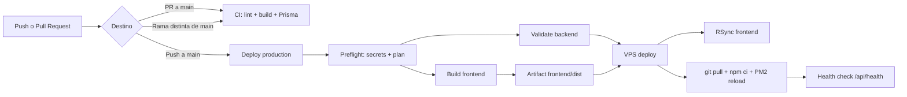

# Oxyra - Guia de CI/CD y despliegue

Esta guia documenta el flujo de GitHub Actions para publicar Oxyra en el VPS de produccion.

## Pipeline



| Workflow | Archivo | Uso |
| --- | --- | --- |
| CI | `.github/workflows/ci.yml` | Pull requests y ramas que no sean `main` |
| Deploy | `.github/workflows/deploy.yml` | Push a `main` y ejecucion manual |

## Secrets obligatorios

Configuralos en **Repository > Settings > Secrets and variables > Actions > Secrets**.

| Secret | Descripcion | Ejemplo |
| --- | --- | --- |
| `VPS_HOST` | IP o dominio del VPS | `vps.example.com` |
| `VPS_USER` | Usuario SSH de despliegue | `jordi` |
| `VPS_PORT` | Puerto SSH | `22` |
| `VPS_SSH_PRIVATE_KEY` | Clave privada SSH completa | Contenido de `id_ed25519` |
| `VITE_API_URL` | URL publica base de la API | `https://jordi.informaticamajada.es` |
| `VITE_STRIPE_PUBLIC_KEY` | Clave publica de Stripe | `pk_live_...` |

## Variables opcionales

Configuralas en **Repository > Settings > Secrets and variables > Actions > Variables**.

| Variable | Descripcion | Valor por defecto |
| --- | --- | --- |
| `VPS_DEPLOY_PATH` | Ruta del repo en el VPS | `/var/www/html/Oxyra` |
| `PRODUCTION_URL` | URL publica del entorno | `https://jordi.informaticamajada.es` |
| `HEALTH_CHECK_URL` | Endpoint de verificacion | `{PRODUCTION_URL}/api/health` |
| `PM2_APP_NAME` | Nombre del proceso en PM2 | `oxyra-api` |

## Preparacion del VPS

El workflow asume que el repositorio ya existe en el servidor:

```bash
cd /var/www/html
git clone git@github.com:Cyod75/Oxyra.git Oxyra
```

Backend:

```bash
cd /var/www/html/Oxyra/Backend
npm ci
npx prisma generate
pm2 start ecosystem.config.cjs --env production
pm2 save
```

Frontend:

```bash
cd /var/www/html/Oxyra/frontend
npm ci --legacy-peer-deps
npm run build
```

Nginx debe servir:

```nginx
root /var/www/html/Oxyra/frontend/dist;

location / {
    try_files $uri $uri/ /index.html;
}

location /api/ {
    proxy_pass http://127.0.0.1:3001;
}
```

## Despliegue manual

En GitHub:

1. Entra en **Actions**.
2. Abre **Deploy | Production**.
3. Pulsa **Run workflow**.
4. Elige que partes quieres publicar:

| Opcion | Uso recomendado |
| --- | --- |
| `deploy_frontend` | Publicar solo cambios visuales o de React |
| `deploy_backend` | Actualizar API, controladores, Prisma o PM2 |
| `run_prisma_push` | Sincronizar schema Prisma con la BD; usar solo cuando lo tengas claro |

## Que hace el deploy

1. Comprueba secrets y muestra el plan en el resumen de GitHub.
2. Construye `frontend/dist` con Vite y lo guarda como artifact.
3. Valida Prisma en el backend antes de tocar el VPS.
4. Sube el frontend con `rsync --delete`.
5. En el VPS ejecuta `git pull --ff-only origin main`, `npm ci`, `npx prisma generate` y recarga PM2.
6. Llama a `/api/health` para confirmar que la API responde.

## Troubleshooting

| Sintoma | Revisar |
| --- | --- |
| `Permission denied (publickey)` | `VPS_SSH_PRIVATE_KEY` y `authorized_keys` del VPS |
| `Not possible to fast-forward` | Hay cambios locales en el VPS; revisalos antes de desplegar |
| `dist/index.html` no existe | Fallo en el build de Vite |
| PM2 no recarga | `PM2_APP_NAME` o `Backend/ecosystem.config.cjs` |
| Health check no pasa | `pm2 logs oxyra-api`, Nginx y `/api/health` |
