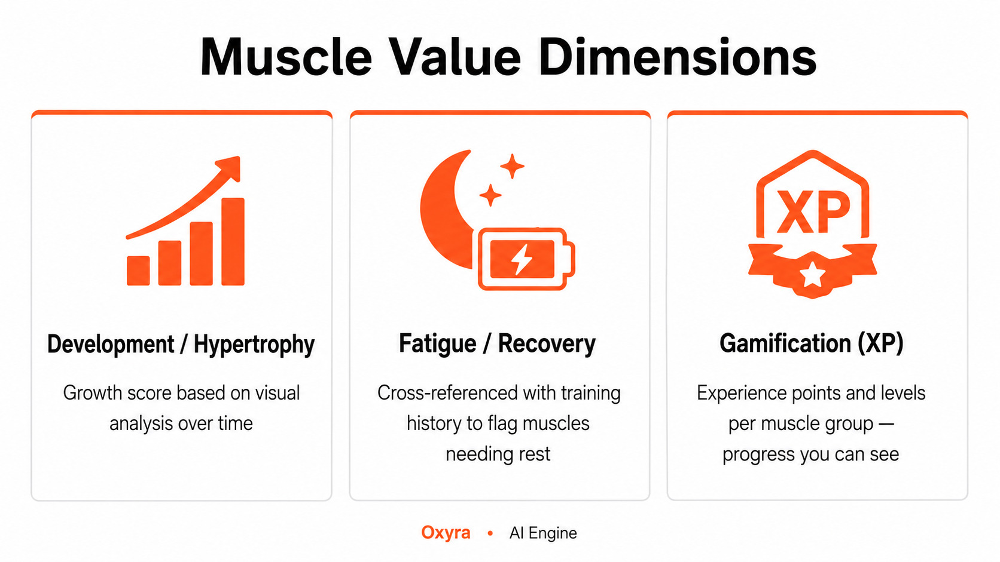
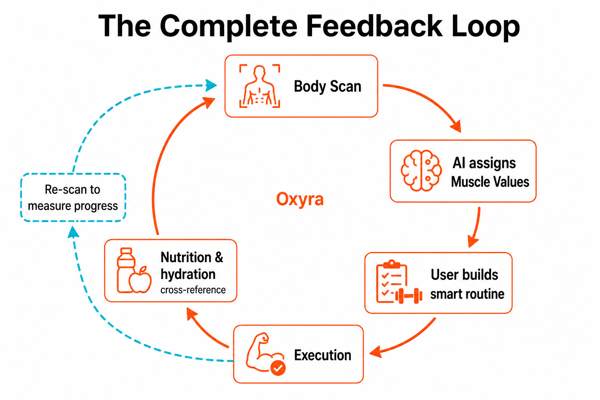
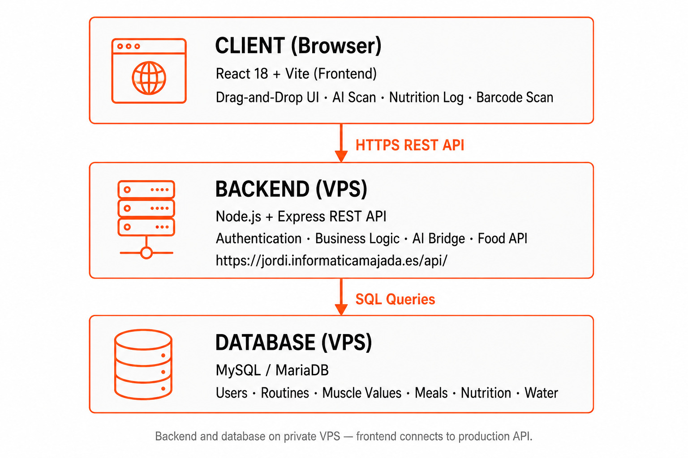
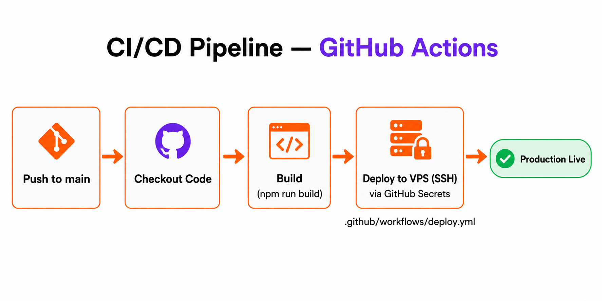

<div align="center">

  

  <br/><br/>

  <p><strong>Next-generation fitness platform combining intelligent workout management,<br/>AI-powered biometric body analysis, and complete nutrition tracking.</strong></p>

  <br/>

  <a href="https://jordi.informaticamajada.es/"><strong>View Live Demo</strong></a>

  <br/><br/>

  
  
  
  

  <br/>

  
  
  

  <br/>

  
  
  

  <br/>

  
  
  

</div>

---

## About the Project

**Oxyra** is a capstone project for vocational training in Web Application Development. It delivers a production-ready web application (with PWA support and Android packaging via Capacitor) that unifies three pillars typically split across separate fitness apps:

- **Dynamic training** — drag-and-drop routines to reorganize exercises in real time at the gym.
- **AI biometric analysis** — computer vision that segments the body and assigns a quantitative **Muscle Value** per muscle group.
- **Nutrition & hydration** — daily meal logging, macros, water intake, and barcode scanning (Open Food Facts).

The user journey follows a continuous loop: **Scan → Plan → Execute → Eat → Re-evaluate**.

> *From manual logging to biometric intelligence — Oxyra turns your body into a data source.*

**Live application:** [https://jordi.informaticamajada.es/](https://jordi.informaticamajada.es/)  
**REST API:** [https://jordi.informaticamajada.es/api/](https://jordi.informaticamajada.es/api/)

---

## Core Features

### Dynamic Workout Management (Drag & Drop)

A fluid interface to build, reorder, and adapt training sessions on the fly. If equipment is occupied, drag an exercise to another slot without breaking the session structure.

### Biometric Muscle Mapping (AI Engine)

The vision engine analyzes a user photo, segments individual muscle groups, and assigns a **Muscle Value** to each zone:

<p align="center">
  
</p>

### Nutrition & Hydration Tracking

- Daily meal log with macronutrient breakdown (calories, protein, carbs, fat).
- Water intake tracker with a simple visual interface.
- Barcode scanner with instant product lookup and logging.

Nutrition data feeds back into the AI layer alongside training history, giving the system a fuller picture of recovery and energy state.

### The Complete Feedback Loop

<p align="center">
  
</p>

---

## Architecture

Oxyra uses a decoupled three-tier architecture deployed on a **private Linux VPS**. Nginx serves the static frontend build; a Node.js process handles the REST API under PM2; MariaDB persists data through Prisma.

<p align="center">
  
</p>

**Request flow**

1. The browser loads static assets from `frontend/dist` (served by Nginx).
2. Requests to `/api/*` are proxied to the Node.js process managed by **PM2**.
3. Express runs business logic and queries **MariaDB** via **Prisma Client**.

---

## Tech Stack

### Frontend (`/frontend`)

- **React 19** + **Vite 8** — SPA, routing (`react-router`), state (`zustand`).
- **Tailwind CSS**, **Radix UI**, **Framer Motion** — UI components and motion.
- **i18next** — internationalization (EN / ES).
- **html5-qrcode** — client-side barcode scanning.
- **Capacitor 8** — Android build and push notifications.
- **Stripe.js** — client-side payments and subscriptions.
- **PWA** (`vite-plugin-pwa`) — installable app with partial offline support.

### Backend (`/Backend`)

- **Node.js** + **Express 4** — REST API, JWT auth, validation (`express-validator`).
- **Prisma 7** — type-safe ORM for **MariaDB** (MySQL provider).
- **bcryptjs** + **jsonwebtoken** — authentication and authorization.
- **Google Generative AI** + **Groq SDK** — AI routines and physique analysis.
- **Cloudinary** + **Multer** — image uploads and storage.
- **Stripe** — webhooks and subscription billing.
- **Open Food Facts** (via custom API routes) — nutrition data from barcodes.
- **Nodemailer** — email verification and password recovery.
- **Helmet**, **CORS**, **rate-limit**, **compression** — security and performance.

### Infrastructure (VPS)

- **Nginx** — web server; document root set to `frontend/dist`.
- **PM2** — keeps the backend process alive and restarts on failure.
- **MariaDB** — relational database on the same VPS.
- **GitHub Actions** — automated frontend build and deployment (see below).

---

## VPS Deployment

Production deployment on a Linux VPS. Base path on the server: `/var/www/html/Oxyra`.

### Server requirements

- Linux VPS
- Node.js ≥ 20
- MariaDB
- Nginx
- PM2 (`npm install -g pm2`)
- Git

### 1. Database (MariaDB + Prisma)

1. Create the database and user in MariaDB.
2. Set `DATABASE_URL` in `Backend/.env` (MySQL/MariaDB connection string).
3. Apply the schema from the backend directory:

```bash
cd Backend
npm install
npx prisma generate
npx prisma db push   # or `migrate deploy`, depending on your workflow
```

### 2. Backend (Node.js + PM2)

```bash
cd /var/www/html/Oxyra/Backend
npm install
# Configure .env: DATABASE_URL, JWT_SECRET, AI keys, Stripe, Cloudinary, etc.

pm2 start server.js --name oxyra-api
pm2 save
pm2 startup   # enable restart on VPS reboot
```

PM2 keeps the API running continuously. After code updates: `pm2 reload oxyra-api` (or `pm2 reload all`).

### 3. Frontend (static build)

```bash
cd /var/www/html/Oxyra/frontend
npm install
npm run build
```

Production assets are output to **`frontend/dist/`**.

### 4. Nginx

Example server block (adjust `server_name`, SSL, and backend port as needed):

```nginx
server {
    listen 80;
    server_name jordi.informaticamajada.es;

    root /var/www/html/Oxyra/frontend/dist;
    index index.html;

    location / {
        try_files $uri $uri/ /index.html;
    }

    location /api/ {
        proxy_pass http://127.0.0.1:3001;
        proxy_http_version 1.1;
        proxy_set_header Host $host;
        proxy_set_header X-Real-IP $remote_addr;
        proxy_set_header X-Forwarded-For $proxy_add_x_forwarded_for;
        proxy_set_header X-Forwarded-Proto $scheme;
    }
}
```

- **Frontend:** Nginx serves files directly from `dist`.
- **API:** `/api/` requests are forwarded to the Express process on PM2 (default port `3001`).

After editing the config: `sudo nginx -t && sudo systemctl reload nginx`.

### Deployment checklist

1. **MariaDB + Prisma** — schema in `Backend/prisma/schema.prisma`, `DATABASE_URL` in `.env`.
2. **Backend** — `npm install` in `Backend/`, process managed by **PM2**.
3. **Frontend** — `npm install` and `npm run build` in `frontend/`; serve **`frontend/dist/`**.
4. **Nginx** — `root` pointing to `dist`, reverse proxy for `/api/` to localhost.

> The production API and database run on the VPS. Local frontend development defaults to `http://localhost:3001` unless `VITE_API_URL` is set (see `frontend/src/config/api.js`).

---

## CI/CD Pipeline

| Workflow | Trigger | Purpose |
|----------|---------|---------|
| [ci.yml](.github/workflows/ci.yml) | Pull requests · branches ≠ `main` | Lint, build frontend, validate Prisma |
| [deploy.yml](.github/workflows/deploy.yml) | Push to `main` · manual | Production deploy to VPS |

Every push to `main` runs **deploy**:

1. **Build on GitHub** — `npm ci` + `npm run build` with `VITE_*` from repository secrets.
2. **Artifact** — `frontend/dist/` uploaded and passed to the deploy job.
3. **Frontend** — RSync over SSH to `frontend/dist` on the VPS.
4. **Backend** — `git pull`, `npm ci`, `prisma generate`, `pm2 reload oxyra-api`.
5. **Health check** — `GET /api/health` with retries and a job summary in Actions.

<p align="center">
  
</p>

**Setup (secrets, SSH key, VPS checklist):** [`.github/DEPLOYMENT.md`](.github/DEPLOYMENT.md)

---

## Repository Structure

```
Oxyra/
├── frontend/          # React + Vite (UI, PWA, Capacitor)
│   ├── public/images/ # README diagrams and static assets
│   └── src/
├── Backend/           # Express + Prisma + AI integrations
│   └── prisma/        # schema.prisma (MariaDB / MySQL)
├── .github/workflows/ # deploy.yml
└── README.md
```

---

## Running the Frontend Locally

Production API and database run on the VPS. You can run the frontend locally; it defaults to `http://localhost:3001` unless you point `VITE_API_URL` at the deployed API.

**Prerequisites:** Node.js ≥ 18 (20 recommended)

```bash
git clone https://github.com/Cyod75/Oxyra.git
cd Oxyra/frontend
npm install
npm run dev
```

The app will be available at [http://localhost:5173](http://localhost:5173).

To use the production API during development:

```bash
# frontend/.env.local
VITE_API_URL=https://jordi.informaticamajada.es
```

Some features require a registered account on the live platform.

---

## Author

<div align="center">

**Jordi M. Monteiro A.**

Capstone project — Web Application Development (Vocational Training)

[](https://github.com/Cyod75)

</div>

---

## License

This project is licensed under the **MIT License** — see the [LICENSE](LICENSE) file for details.

---

<div align="center">
  <sub>Built by Jordi M. Monteiro A. · Oxyra © 2026</sub>
</div>
